# Post-Translational Modifications on HLA Class I Presented Peptides

**Caron Laboratory**

---

## Study Overview

This analysis characterizes post-translational modifications (PTMs) identified on HLA class I peptides from the JY cell line using data-dependent acquisition mass spectrometry. All analyses are restricted to peptides of length 8-14 amino acids.

**HLA Alleles:** A\*02:01, B\*07:02, C\*07:02

---

## Data Summary

| Dataset | Peptides |
|---------|----------|
| Background (unmodified) | 77,100 |
| **Total Modified** | **8,804** |
| Cysteinylation | 2,355 |
| Deamidation | 2,081 |
| Oxidation | 1,640 |
| Phosphorylation | 702 |
| Acetylation | 510 |
| Methylation | 475 |
| Ubiquitination | 426 |
| Dimethylation | 319 |
| Citrullination | 250 |
| N-Glycosylation | 42 |
| SUMOylation | 4 |

---

## PTM Categories

| PTM Type | Target Residues |
|----------|-----------------|
| Phosphorylation | S, T, Y |
| Acetylation | K, N-terminus |
| Cysteinylation | C |
| Methylation | K, R |
| Dimethylation | K, R |
| Deamidation | N, Q |
| Biological Oxidation | P, I, L, Q, S, T, V, C, D, E, N, Y, G, K, R |
| Citrullination | R |
| Ubiquitination | K |
| N-Glycosylation | N |
| SUMOylation | K |

### HLA Binding Classification

| Category | EL Rank Threshold |
|----------|-------------------|
| Strong binder | < 0.5% |
| Weak binder | 0.5% – 2% |
| Non-binder | ≥ 2% |

---

## Figure 1: PTM Composition

### Figure 1A: PTM Distribution

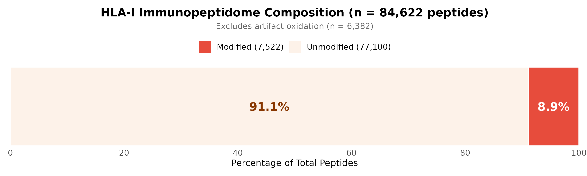

Distribution of unique modified peptides by PTM type (length 8-14 amino acids).

### Figure 1B: PTM Proportions

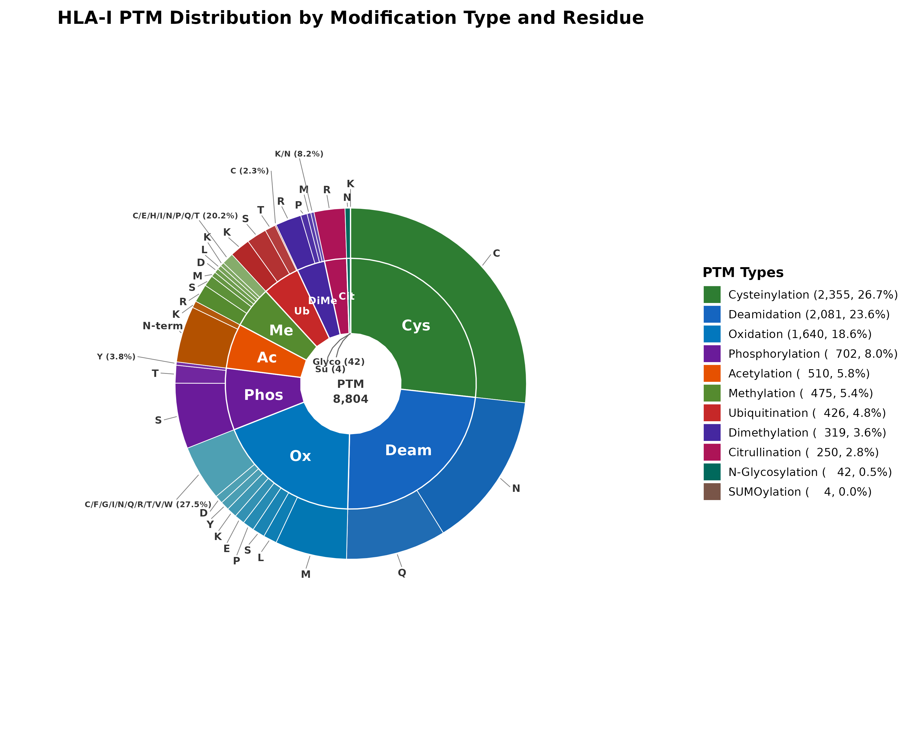

Proportional representation of each PTM class within the modified peptidome.

---

## Figure 2: Peptide Length Distribution

Ridgeline density plot comparing peptide length distributions across PTM types. Gray distribution represents unmodified background peptides.

---

## Figure 4A: PTM Landscape

Circos diagram illustrating relationships between PTM types (outer sectors), modified residues (links), and HLA binding alleles (inner elements). Link density reflects relative abundance of each PTM-residue combination.

---

## Figure 4B: Positional Enrichment

### By PTM and Residue

Log₂ enrichment of PTM occurrence at peptide positions 8-14 relative to background amino acid positional distribution. PTM+residue combinations with ≥20 occurrences. Color scale: blue (depletion) to red (enrichment), capped at ±3. Correlation column indicates similarity to background distribution.

### By PTM Type (Aggregated)

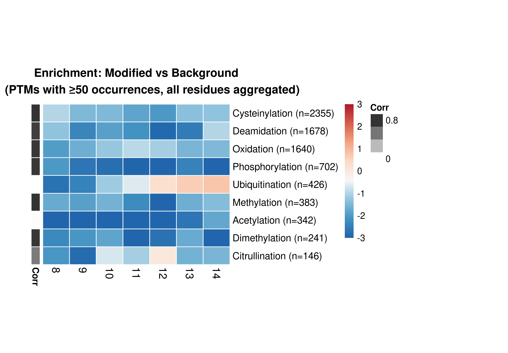

Aggregated positional enrichment by PTM type (≥50 occurrences), combining all modified residues.

---

## Figure 4C: PTM Position Density

Density curves showing modification site distribution across peptide positions 8-14. PTM+residue combinations with ≥50 modifications.

---

## Figure 5A: HLA Binding Affinity

### Strong Binders by PTM and Residue

Percentage of strong HLA binders (EL Rank < 0.5%) for each PTM+residue combination across alleles A0201, B0702, and C0702. Combinations with ≥10 peptides.

### Weak Binders by PTM and Residue

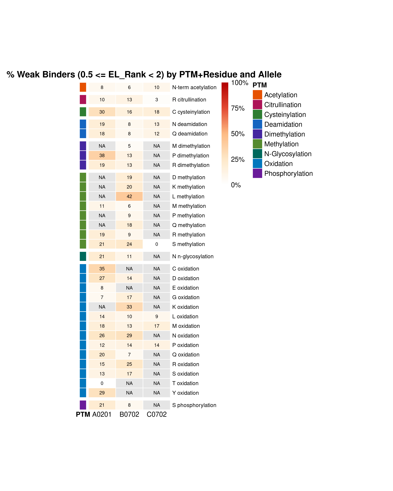

Percentage of weak HLA binders (0.5% ≤ EL Rank < 2%) for each PTM+residue combination.

### Strong Binders by PTM Type

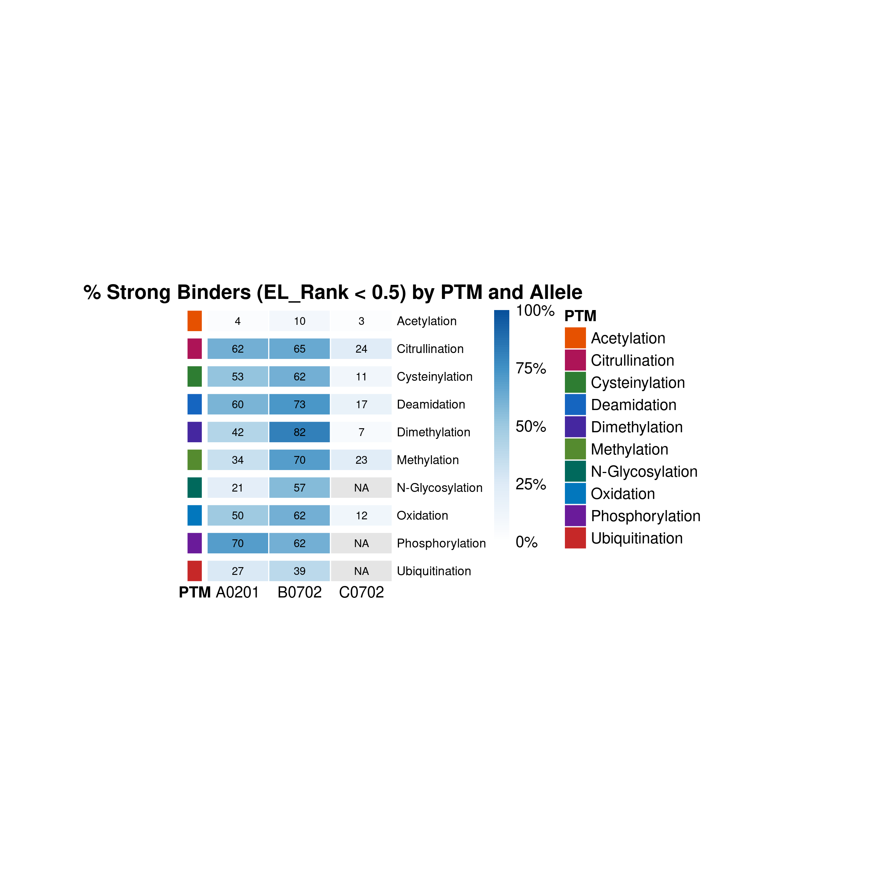

Strong binder percentages aggregated by PTM type across alleles.

### Weak Binders by PTM Type

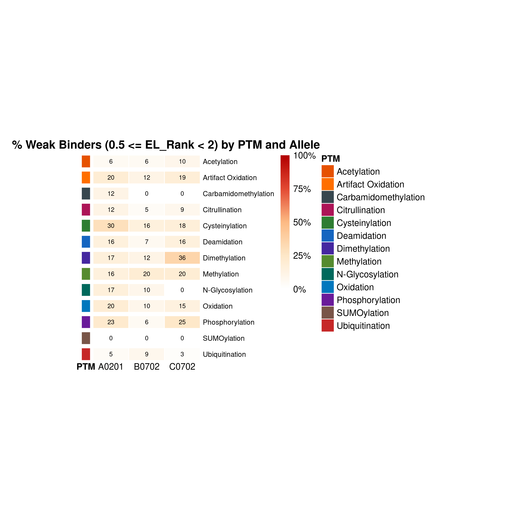

Weak binder percentages aggregated by PTM type.

---

## Figure 5B: EL Rank Distribution

EL Rank distribution comparison between modified peptides (colored outlines) and background unmodified peptides (gray) within the binder range (EL Rank 0-2). Dashed lines indicate strong binder (0.5%) and weak binder (2%) thresholds.

---

## Figure 6: Specific PTM Analyses

### Figure 6A: Doubly Phosphorylated Peptides

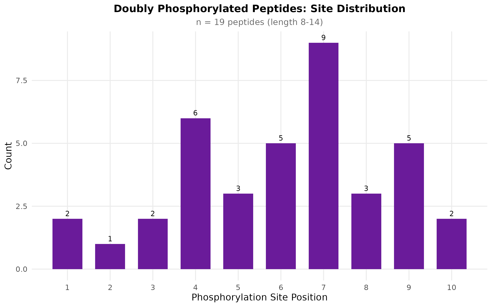

Site distribution for peptides carrying two or more phosphorylation sites.

### Figure 6B: Ubiquitination Remnants

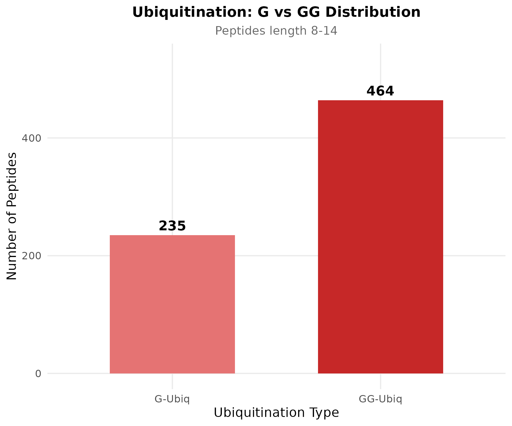

Comparison of ubiquitin remnant types following tryptic digestion: single glycine (G, +57 Da) versus diglycine (GG, +114 Da).

### Figure 6C: Oxidation Classification

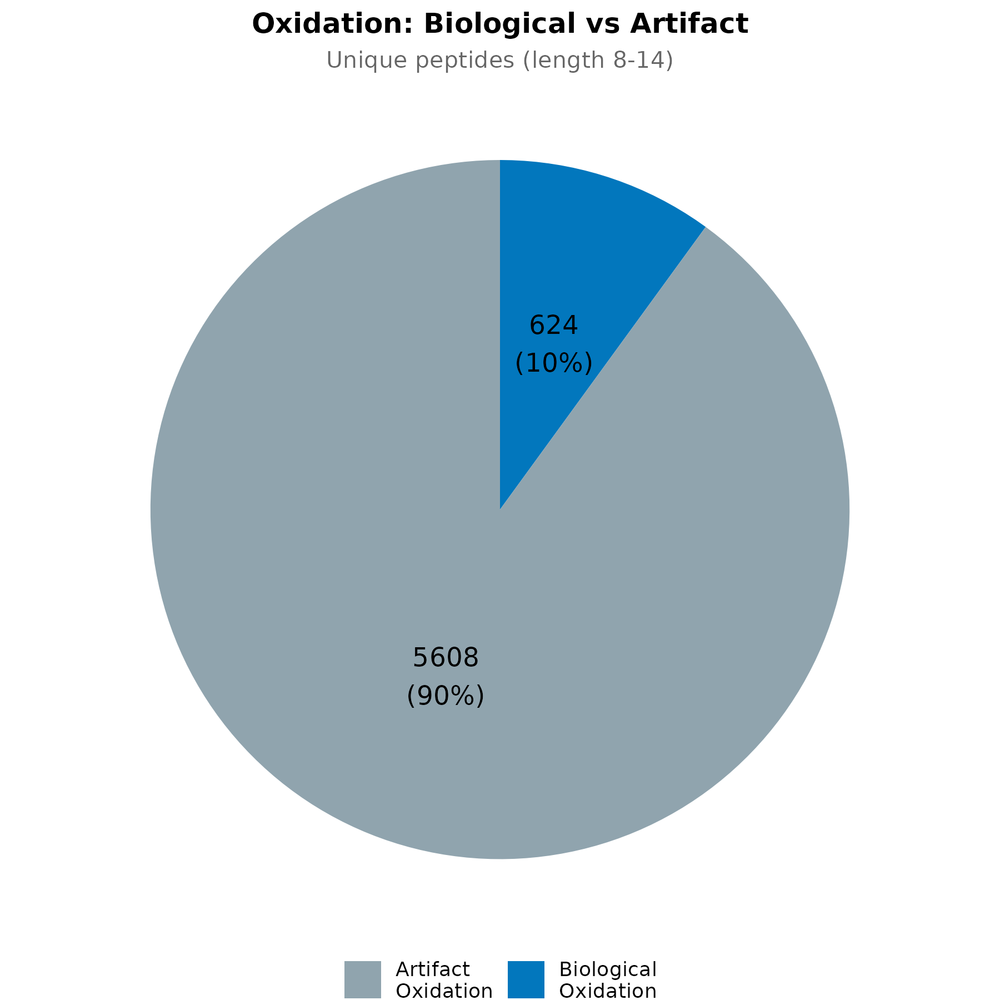

Classification of oxidized peptides: biological oxidation (P, I, L, Q, S, T, V, C, D, E, N, Y, G, K, R) versus artifact oxidation (M, W, H).

### Figure 6D: Biological Oxidation by Residue

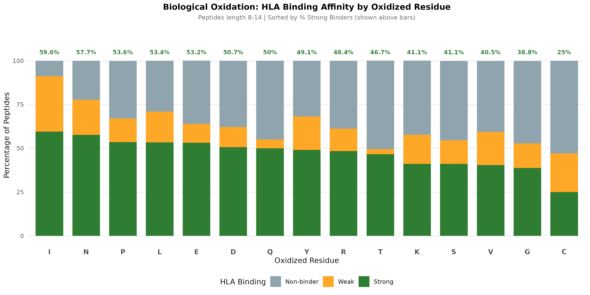

HLA binding classification for biologically oxidized peptides stratified by oxidized residue. Sorted by percentage of strong binders.

### Figure 6D2: Biological Oxidation Heatmap

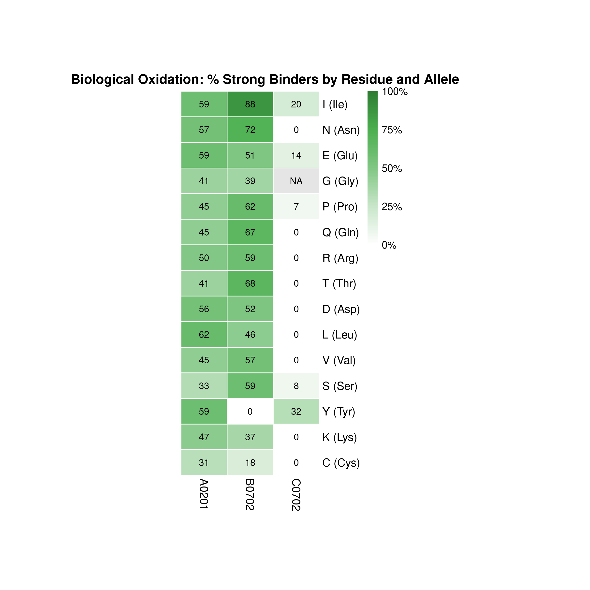

Strong binder percentages for biological oxidation cross-tabulated by residue and HLA allele.

### Figure 6E: Glycan Complexity

N-glycosylation analysis stratified by glycan complexity (sum of monosaccharide units). Categories: Simple (1-3), Medium (4-8), Complex (9-15).

### Figure 6E2: Glycan Types

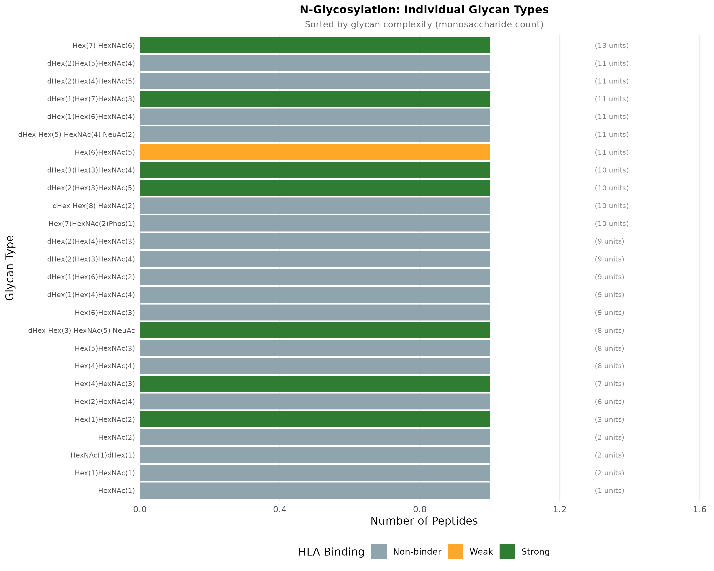

Individual glycan structures with HLA binding classification, sorted by monosaccharide count.

---

**Analysis Date:** January 2026 | **Made by:** Peter Kubiniok
