# HLA-I PTM Analysis Figures

Analysis of post-translational modifications in HLA class I immunopeptidome from JY cells (DDA-MS).

Data source: `HLA-I_JY_DDA_PTMs_ResultsSummary_01062026.xlsx`

---

## Figure 1: PTM Overview

### 1A - PTM counts

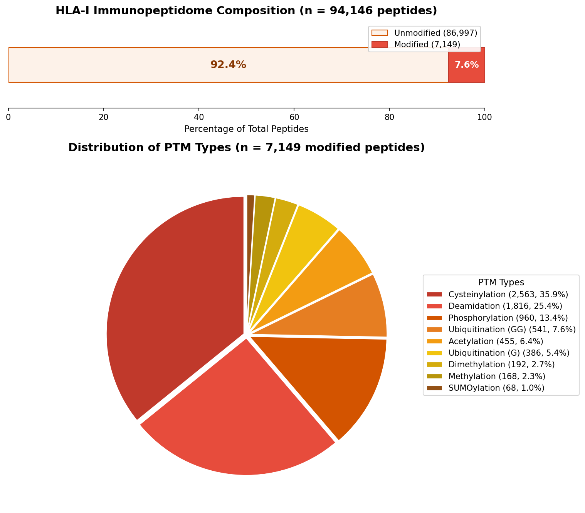

Total peptide counts per PTM type. Cysteinylation and oxidation dominate the dataset. Phosphorylation, deamidation also well represented. Lower counts for citrullination, ubiquitination, acetylation.

### 1B - Distribution

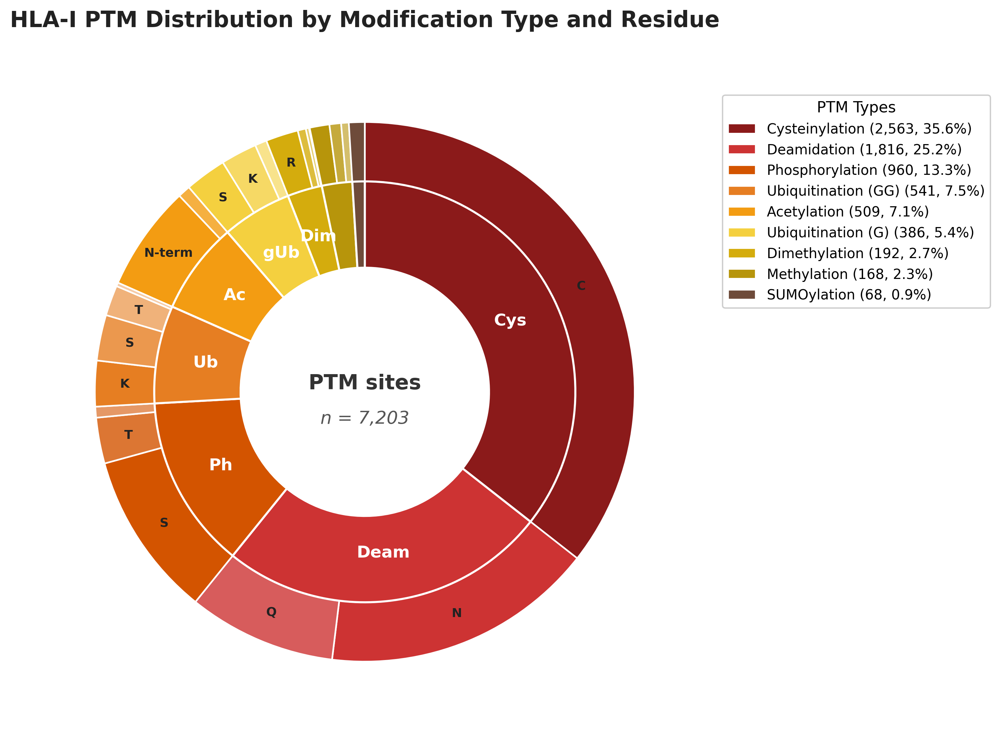

Proportional breakdown of PTM types.

---

## Figure 2: Length Distribution

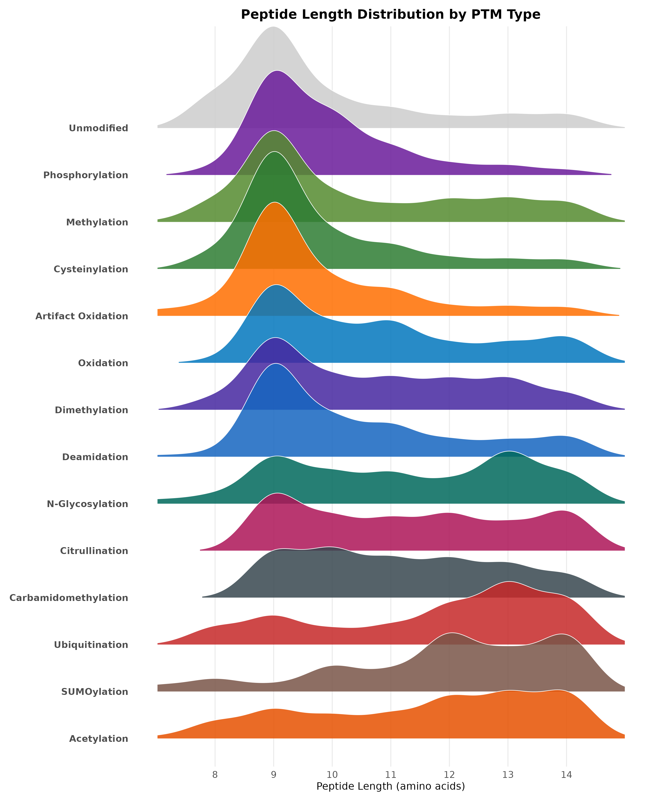

Peptide length distribution comparing modified vs unmodified (background). Background peptides from the same cells without PTM filtering. Canonical HLA-I length is 8-11aa, predominantly 9-mers. Checked if PTM-bearing peptides show different length preferences.

---

## Figure 3: Binding Analysis

### 3A - Phospho EL Rank

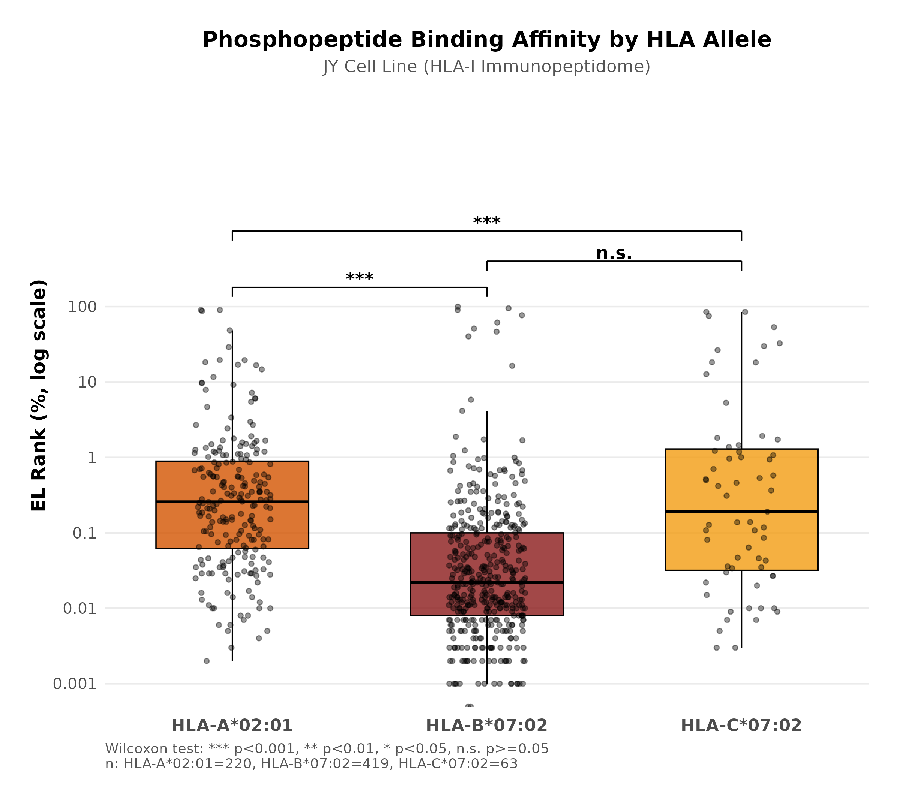

EL Rank distribution for phosphopeptides. EL Rank from NetMHCpan 4.1 - percentile rank where lower = stronger binding. Cutoffs: <0.5% strong binder, 0.5-2% weak binder, >2% non-binder.

### 3B - PTM Binding Heatmap

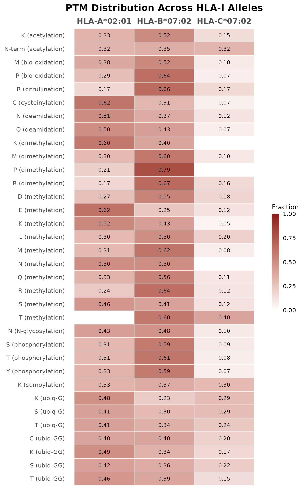

Binding category breakdown per PTM and allele. Three alleles in JY cells: HLA-A*02:01, HLA-B*07:02, HLA-C*07:02. Shows % strong/weak/non-binder for each PTM type.

---

## Figure 4: Position Analysis

### 4A - Circos Plot

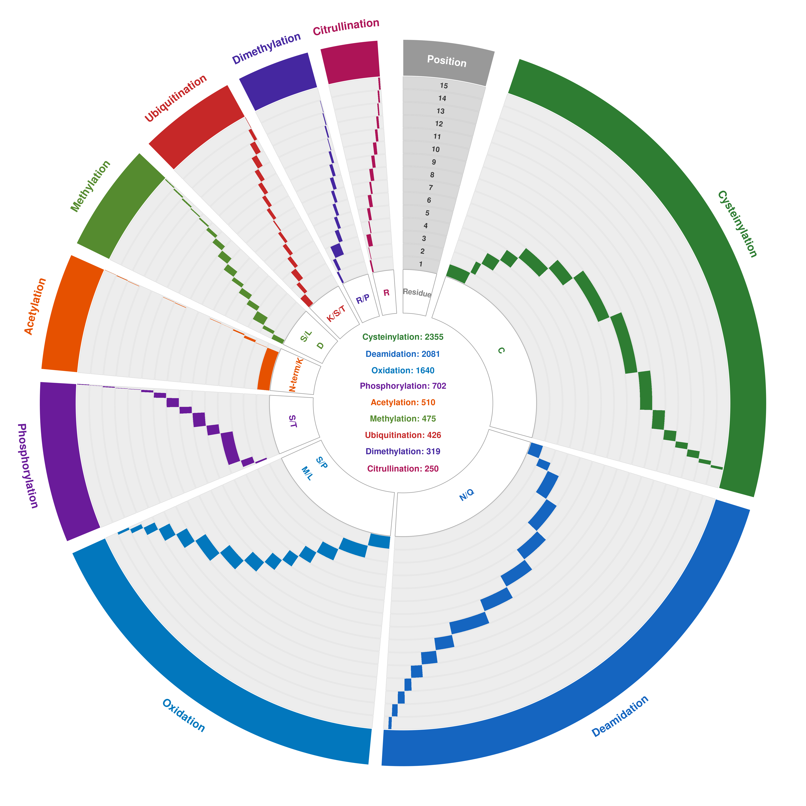

Circos visualization of PTM positional preferences. Outer track: amino acid residues that carry PTMs. Inner track: peptide positions 1-15. Links connect residue-PTM combinations to their positions within peptides. Link width proportional to frequency. Shows which positions are preferred for each modification type.

Built using circlize package in R. Filtered to combinations with n>=10 peptides.

### 4B - Position Enrichment Heatmap

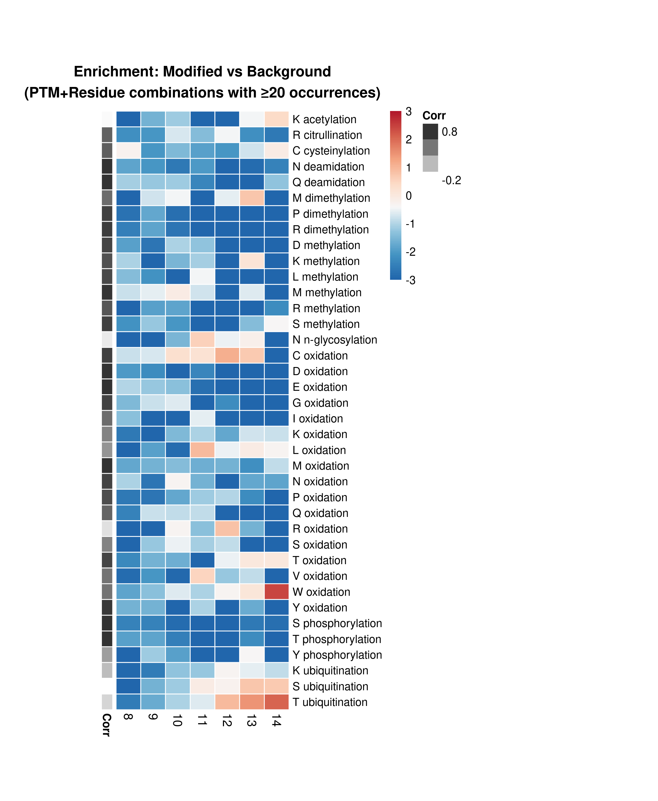

Log2 enrichment of PTM at each position vs background.

Calculation:
- For each PTM+residue combination, counted occurrences at positions 1-15
- Background: positional distribution of the same amino acid in unmodified peptides
- Enrichment = log2(freq_modified / freq_background)
- Capped at +/-3 for visualization

Sorted by PTM type, then by residue within each PTM. Blue = depleted vs background, red = enriched. Shows position-specific biases - e.g. some PTMs prefer N-terminal or C-terminal positions, anchor positions (P2, P9) show distinct patterns.

### 4C - Position Density

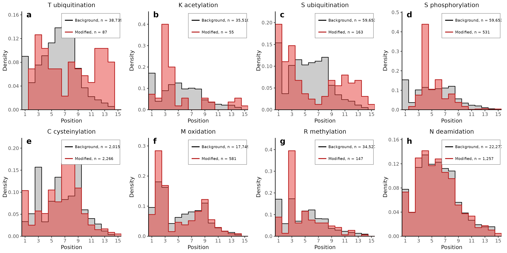

Step histograms comparing positional distribution of modified residues (red) vs same amino acid in background (gray filled). Each panel is one PTM+residue combination. X-axis: position in peptide, Y-axis: fraction at that position.

Selected PTMs that showed interesting positional patterns in the enrichment analysis.

---

## Figure 5: HLA Binding Effects

### 5A - EL Rank Ratio Heatmap

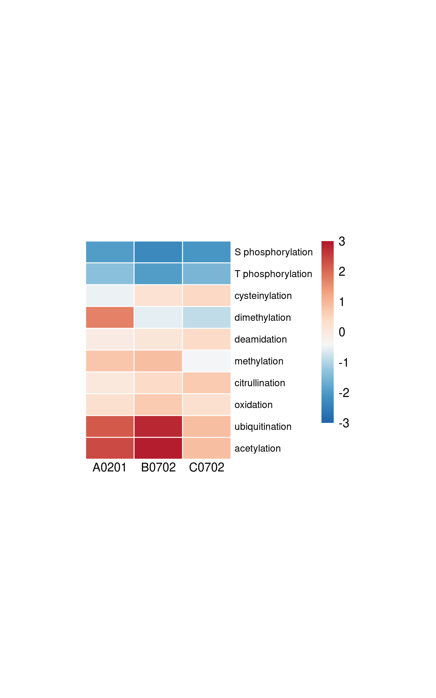

Log2 ratio of mean EL Rank (modified / background) per PTM and allele.

Calculation:
- Mean EL Rank for each PTM type per allele
- Mean EL Rank for background peptides per allele
- Ratio = PTM_mean / BG_mean
- Log2 transformed

Blue = lower EL Rank than background (better binding), red = higher (worse binding). Sorted by mean effect across alleles.

### 5A - Strong Binders by Residue

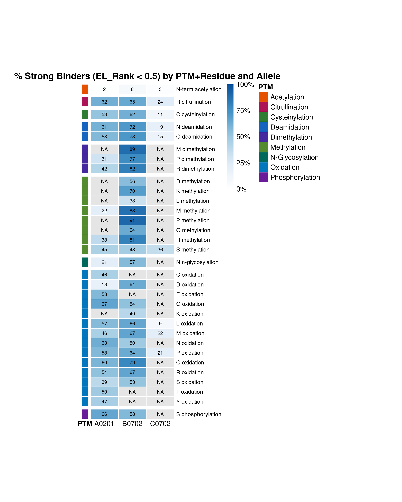

Percentage of strong binders (<0.5% EL Rank) for each PTM+residue combination.

Method:
- Merged PTM site data with binding predictions by peptide sequence
- Grouped by PTM type, residue, and allele
- Calculated % classified as strong binder
- Filtered to n>=10 peptides per group
- Sorted by PTM then residue

Color bar on left shows PTM type. Gaps separate different PTM categories. Numbers in cells show % strong binders. Allows comparison of how specific residue modifications affect binding - e.g. phospho-S vs phospho-T vs phospho-Y.

### 5A - Binder Categories

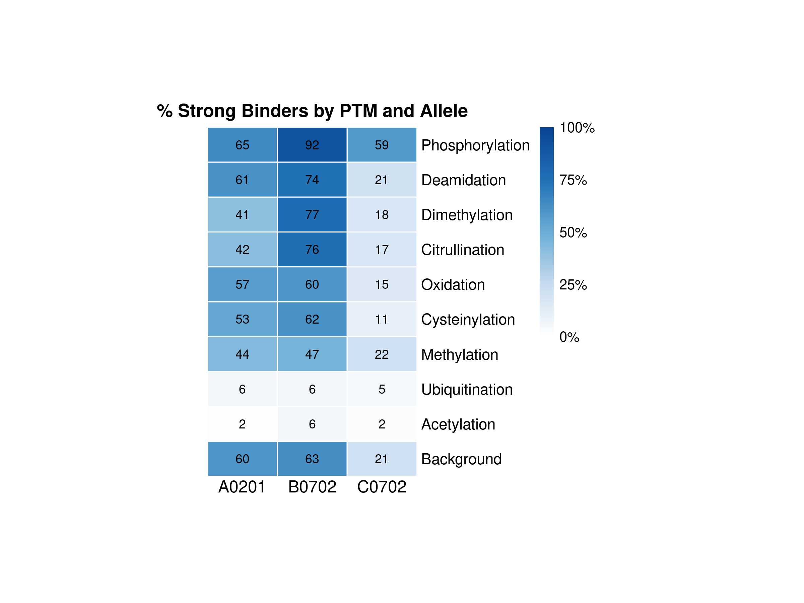

Alternative view showing binder category proportions.

### 5B - EL Rank Histograms

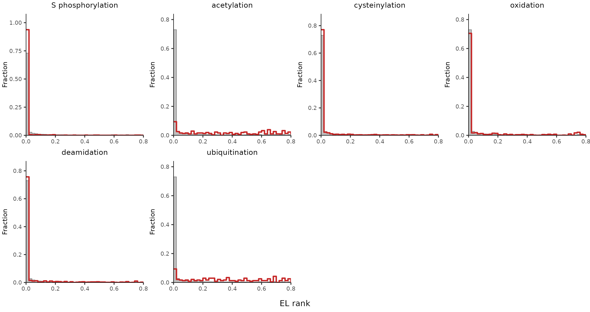

Direct comparison of EL Rank distributions. Gray filled = background (unmodified peptides), red outline = modified. Shift left = improved binding, shift right = worse binding.

Histograms binned at 0.02 intervals, normalized to fraction. Selected PTMs shown.

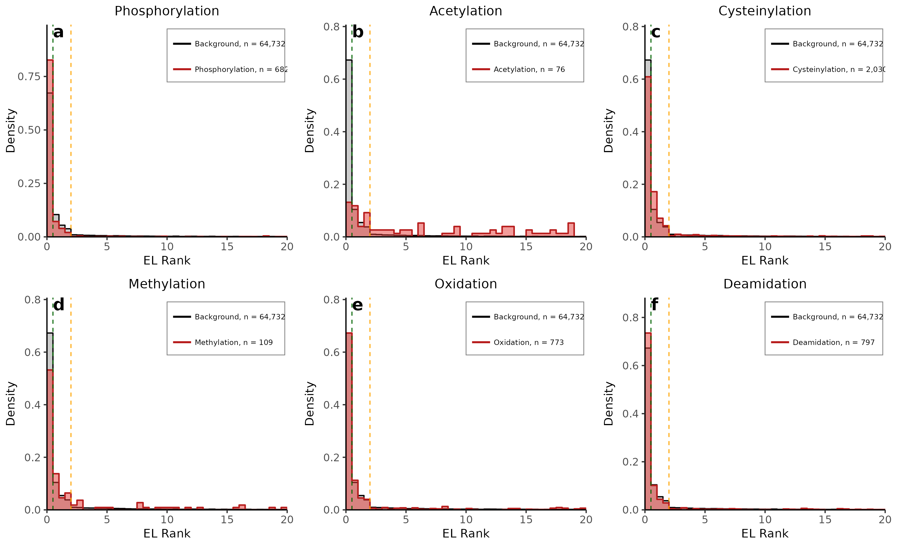

---

## Methods Summary

**Data processing:**
- Input: Excel file with separate sheets per PTM type + background
- Each sheet contains peptide sequences, PTM sites, NetMHCpan predictions
- Parsed PTM sites to extract modified residue and position within peptide

**Binding predictions:**
- NetMHCpan 4.1 EL Rank scores (already in dataset)
- Allele assignment based on best predicted allele

**Position analysis:**
- Peptide positions numbered 1-15 from N-terminus
- Background calculated as positional distribution of each amino acid across all unmodified peptides
- Enrichment = log2(observed/expected) with pseudocount

**Filtering:**
- Most analyses filtered to n>=10 peptides per group
- Ensures statistical stability

**Code:** `PTM_figures.R` generates all panels from the input Excel file.

---

## Data Summary

| Dataset | Peptides |
|---------|----------|
| Background (unmodified) | 77,100 |
| Phosphorylation | 702 |
| Cysteinylation | 2,355 |
| Oxidation | 955 |
| Deamidation | 958 |
| Acetylation | 308 |
| Methylation | 140 |
| Dimethylation | 137 |
| Citrullination | 138 |
| Ubiquitination | 235 |

HLA alleles: A*02:01, B*07:02, C*07:02
